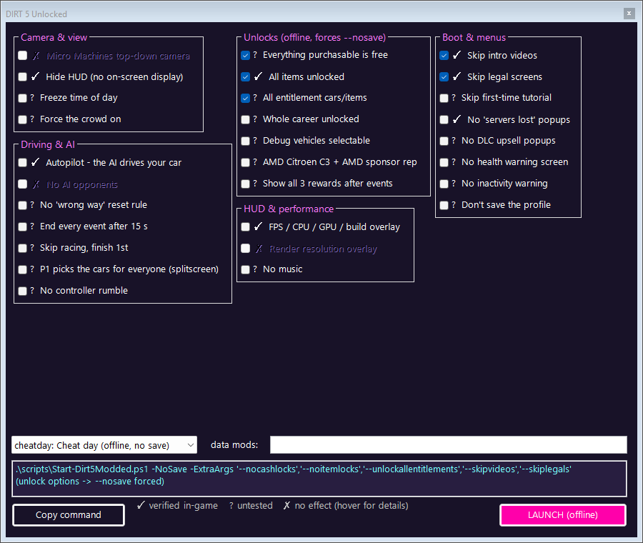
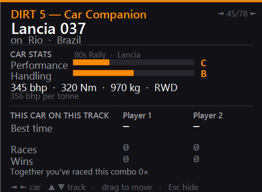

# DIRT 5 mods & research — by macha

> [!WARNING]
> **Read this first.**
> - **About 99 % of the code, tools and docs in this repository were written by an AI** (Claude Code), directed and play-tested by us. We did not write most of this code ourselves and can't vouch for every line.
> - This is a **hobby project**: [@6uhrmittag](https://github.com/6uhrmittag) and [@VoidCrowned](https://github.com/VoidCrowned) enjoy DIRT 5 very, very much and just wanted a bit more variety in this lovely game.
> - **Nothing is guaranteed** — no warranty, no support promise, no roadmap. Things may break, may not work on your version of the game, or may mess up your game data (there is a *Restore vanilla* button; keep your own backups anyway).
> - Offline only. Not affiliated with or endorsed by Codemasters or EA. No game files are included.

The first mod tools for **DIRT 5** (Codemasters, 2020): a mod loader, a launcher for the game's hidden developer options, a pile of silly splitscreen party mods, and the reverse-engineering notes that made it possible. Built for our own couch sessions, shared for anyone who wants to take the game apart too.

> **Personal & experimental.** Offline single-player/splitscreen only — never take modded data online. Not affiliated with or endorsed by Codemasters or EA. This repository contains **no game files**: every mod is generated from *your own* copy of the game at install time.


| | |
|---|---|
|  |  |
|  |  |

## What's inside

| | what it does | docs |
|---|---|---|
| **D5ML** — mod loader | mod folders with loose files (any size, even brand-new files), PNG textures in every format the game uses, colour-grading LUTs, effects, database patches; load order, conflicts, one-click restore | [`docs/release/D5ML.md`](docs/release/D5ML.md), [`mods/README.md`](mods/README.md) |
| **DIRT 5 Unlocked** | launcher for the game's hidden developer command-line options (autopilot, no HUD, unlocks …) with honest ✓/?/✗ status per option | [`docs/release/Unlocked.md`](docs/release/Unlocked.md) |
| **Example mods** | Trackside Takeover, Synthwave 037, a new 4th livery, Night Vision Racing, Vivid, Rival Roster, Bedtime Arcade | [`mods/`](mods/) |
| **Party mods** | physics/AI/UI recipes for splitscreen nights: moon gravity, black ice, tipsy cars, UwU menus, pub texts, a party launcher that picks by the clock | [`docs/party-mods.md`](docs/party-mods.md) |
| **Test harness** | unattended in-game test of a mod: launch → menus → autopilot race → lap time + crash count via OCR | `scripts/Test-Dirt5Mod.ps1` |
| **Companion apps** | second-monitor session wall, car/track stats overlay, read-only save inspector (C#) | [Companion apps](#companion-apps-c) |
| **Research** | pack/index format, texture formats, LUTs, localisation, hidden options, memory probing | [`FINDINGS.md`](FINDINGS.md), [`docs/research/`](docs/research/) |

## Quick start

Needs Windows, [Python 3.12+](https://www.python.org/) and [PowerShell 7](https://aka.ms/powershell).

```powershell
python -m pip install lz4 numpy pillow
pwsh -File scripts\D5ML.ps1                 # the mod loader window
pwsh -File scripts\Dirt5-Unlocked.ps1       # the hidden-options launcher
python scripts\d5ml.py doctor               # self-check if something doesn't work
```

Or build the release zips (`pwsh -File scripts\Pack-Tools.ps1`) — they contain double-click `.bat` starters and the example mods.

## Compatibility

- **Tested:** the Microsoft Store build v1.2767.60 as a regular (loose, unpacked) folder install, Windows 11. The game's own packs are never written; mods go into an unused pack slot plus a patched index, and *Restore vanilla* puts the backed-up index back.
- **Sealed Store/Xbox app installs** (WindowsApps) can't be modded — Windows blocks writes there. The read-only tools (extractor, save inspector, companion apps) work.
- **Steam:** untested. D5ML refuses to run on an index format it doesn't know.

## The formats, in one paragraph

DIRT 5 does **not** use NeFS like the older EGO games. Its `dat/*.dat` packs are solid streams of 128 KiB LZ4 blocks, indexed by `dat/index/dat.ndx` (file tree + chunk table; entry hash = first 8 bytes of MD5(path)). Textures are EVO `.gtx` containers (BC1/BC4/BC5/BC7, RGBA8/16F/32F, R11G11B10F LUTs) with streamed high-res levels in `_tierN.gmp`; car physics are plain-text `.vdef` files with inheritance; UI text lives in length-prefixed `.loc` tables; databases like the livery list are JSON with FNV-1a-64 name hashes as GUIDs. Everything with byte offsets and how it was verified: [`FINDINGS.md`](FINDINGS.md).

## Repository layout

```
scripts/     Python + PowerShell tools: d5x (pack reader), d5mod (patch engine + recipes), d5tex (texture codec),
             d5ml (mod loader) + D5ML.ps1, Dirt5-Unlocked.ps1, Test-Dirt5Mod.ps1, Send-Dirt5Input.ps1 (drive the game),
             Read-Dirt5Text.ps1 (OCR), Set-Dirt5Offline.ps1 (firewall block), Hunt-Dirt5.ps1 (memory scanner)
mods/        D5ML mod folders (only the examples are versioned)
src/         C# (.NET 8): Dirt5.Probe (container reader), Dirt5.TrackCompanion (overlays), Dirt5.SaveInspector
docs/        release pages + screenshots, party mods, option catalogue, research notes
FINDINGS.md  the living technical log - the source of truth for what is verified
samples/ extracted/ tools/ release/   local scratch (git-ignored - never commit game files)
```

## Offline safety toggle

Blocks the game's network access via Windows Firewall — no game files touched, fully reversible. From an **elevated** PowerShell:

```powershell
powershell -File scripts\Set-Dirt5Offline.ps1 -Enable -InstallPath 'C:\Games\DIRT 5'
powershell -File scripts\Set-Dirt5Offline.ps1 -Status
powershell -File scripts\Set-Dirt5Offline.ps1 -Disable
```

## Companion apps (C#)

Open `Dirt5Modding.sln` in Visual Studio 2022 (.NET 8 SDK). `Dirt5.Probe` references NefsLib from `tools/` — clone it first: `git -C tools clone --depth 1 https://github.com/EgoEngineModding/ego.nefsedit.git`.

- **Couch Session Wall** — `dotnet run --project src\Dirt5.TrackCompanion -- --wall`: a full-screen live gallery on the second monitor while you play splitscreen on the first (live view, auto-curated top moments, filmstrip, session poster). Never takes focus, touches no game files. The OCR session diary is experimental.
- **Car Companion overlay** — `dotnet run --project src\Dirt5.TrackCompanion -- --secondary`: per player, how often each of you raced the selected car on the selected track, with a "who's faster" mark. Set your names with `--set-player 1 "Name"` / `--set-player 2 "Name"`. Run `python scripts\export_car_stats.py` once to fill the car card (grades, bhp, Nm, kg, drivetrain, class) from your game.
- **Save inspector** — `dotnet run --project src\Dirt5.SaveInspector`: read-only catalog of the Xbox WGS save blobs (ghosts, profile, livery recipes).



## License

MIT for the code, docs and original artwork in this repo — see [`LICENSE`](LICENSE). DIRT 5 and its assets belong to their owners; nothing of theirs is included here.
