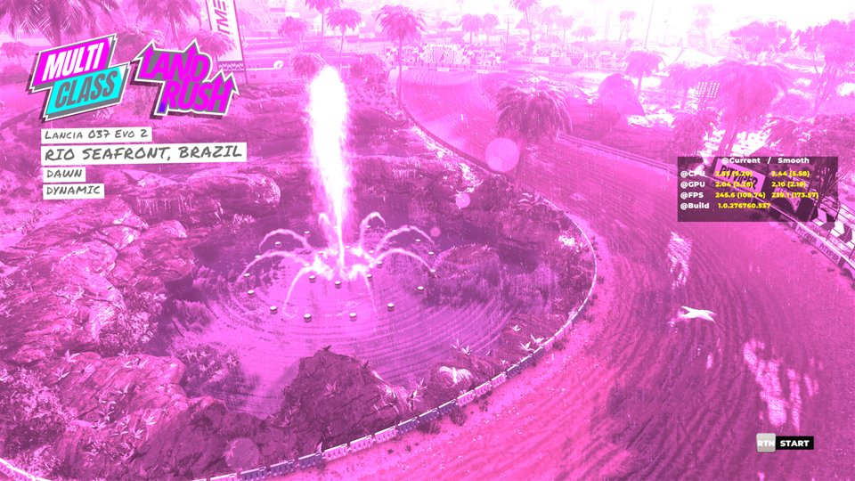

# Colour-grading LUTs: which event uses which

Generated by `python scripts/lut_map.py --md docs/lut-map.md` from the game data (read-only). LUT files: `data:textures/render/luts/<name>.gtx` (32 × 32 × 32, R11G11B10 float). `@0.4` = the key starts at 40 % race progress; several keys blend over the race.

## Arcade / Free Play weather (arcadeweatherdata)

| weather | timeline | LUT |
|---|---|---|
| Weather Dynamic | `TimeTrial/Arcade_Dynamic_01.txt` | DIRT5_Base_Overcast_Day |
| Weather Dry | `TimeTrial/TimeTrial_Dry_01.txt` | DIRT5_Base_Clear_Day |
| Weather Rain | `TimeTrial/TimeTrial_Wet_01.txt` | DIRT5_Base_Overcast_Day |
| Weather Snow | `Afternoon_Snow/afternoon_clear_snow_01.txt` | DIRT5_Cold_Clear_Day |

**Verified in-game 2026-09-26:** tinting `DIRT5_Base_Overcast_Day` magenta, `DIRT5_Base_Clear_Day` green and `DIRT5_Cold_Clear_Day` blue turned the default Free Play race (Rio Seafront, weather *Dynamic*) magenta — as the table says. The menus use another grade and stayed normal.

The arcade `Arcade_*` timelines (season variants) use:

| timeline | LUT |
|---|---|
| `arcade/arcade_dry_autumn.txt` | DIRT5_Base_Clear_Day |
| `arcade/arcade_dry_spring.txt` | DIRT5_Base_Clear_Day |
| `arcade/arcade_dry_summer.txt` | DIRT5_Base_Clear_Day |
| `arcade/arcade_dry_winter_01.txt` | DIRT5_Cold_Clear_Day |
| `arcade/arcade_dry_winter_02.txt` | DIRT5_Cold_Clear_Day |
| `arcade/arcade_snow_winter.txt` | DIRT5_Cold_Clear_Day |
| `arcade/arcade_wet_autumn.txt` | DIRT5_Base_Overcast_Day |
| `arcade/arcade_wet_spring.txt` | DIRT5_Base_Overcast_Day |
| `arcade/arcade_wet_summer.txt` | DIRT5_Base_Overcast_Day |
| `arcade/arcade_wet_winter.txt` | DIRT5_Cold_Clear_Day |

## Career + service-pack events by location

321 events (eventdata `TimelineFileName`). Count = events whose timeline uses the LUT.

| location | LUTs (events) |
|---|---|
| Brazil | `DIRT5_Base_Clear_Evening` (14), `DIRT5_Base_Clear_Day` (13), `DIRT5_Base_Overcast_Day` (5), `DIRT5_Base_Clear_Night` (5), `DIRT5_Cold_Clear_Evening` (4), `(level default)` (2) |
| China | `DIRT5_Base_Clear_Day` (13), `DIRT5_Base_Clear_Evening` (12), `DIRT5_Base_Clear_Night` (8), `DIRT5_Base_Overcast_Day` (7), `DIRT5_Cold_Clear_Day` (3), `DIRT5_Cold_Clear_Evening` (2) |
| Greece | `DIRT5_Base_Clear_Day` (16), `DIRT5_Base_Clear_Evening` (11), `DIRT5_Base_Overcast_Day` (8), `DIRT5_Base_Clear_Night` (6), `DIRT5_Cold_Clear_Day` (2), `DIRT5_Cold_Clear_Evening` (2), `Default_Dirt5_Grading_clear_day` (1), `DIRT5_Cold_Clear_Night` (1) |
| Italy | `DIRT5_Base_Clear_Day` (11), `DIRT5_Base_Clear_Night` (8), `DIRT5_Cold_Clear_Day` (6), `DIRT5_Base_Clear_Evening` (4), `DIRT5_Base_Overcast_Day` (3), `DIRT5_Cold_Clear_Evening` (2) |
| Morocco | `DIRT5_Base_Clear_Day` (15), `DIRT5_Base_Clear_Evening` (6), `DIRT5_Cold_Clear_Evening` (4), `DIRT5_Cold_Clear_Night` (3), `DIRT5_Cold_Clear_Day` (2), `DIRT5_Base_Overcast_Day` (2), `DIRT5_Base_Clear_Night` (1) |
| Nepal | `DIRT5_Cold_Clear_Evening` (11), `DIRT5_Cold_Clear_Day` (7), `DIRT5_Cold_Clear_Night` (3), `DIRT5_Base_Overcast_Day` (1), `DIRT5_Base_Clear_Night` (1) |
| Non Applicable | `DIRT5_Cold_Clear_Evening` (15), `DIRT5_Base_Clear_Day` (10), `DIRT5_Base_Clear_Night` (3) |
| Norway | `DIRT5_Cold_Clear_Evening` (16), `DIRT5_Cold_Clear_Night` (14), `DIRT5_Cold_Clear_Day` (6), `DIRT5_Base_Overcast_Day` (2), `DIRT5_Base_Clear_Evening` (2), `DIRT5_Base_Clear_Day` (2) |
| SouthAfrica | `DIRT5_Base_Clear_Day` (8), `DIRT5_Base_Clear_Evening` (5), `DIRT5_Base_Clear_Night` (4), `DIRT5_Base_Overcast_Day` (2), `DIRT5_Cold_Clear_Day` (2), `DIRT5_Cold_Clear_Evening` (2), `(level default)` (1) |
| USAArizona | `DIRT5_Base_Day_Grading` (27), `DIRT5_Base_Clear_Evening` (10), `DIRT5_Base_Clear_Day` (6), `DIRT5_Base_Clear_Night` (5), `Default_Dirt5_Grading_clear_day` (4), `DIRT5_Cold_Clear_Evening` (4), `DIRT5_Cold_Clear_Night` (3), `DIRT5_Cold_Clear_Day` (2), `DIRT5_Base_Overcast_Day` (1), `(level default)` (1) |
| USARooseveltIsland | `DIRT5_Cold_Clear_Evening` (16), `DIRT5_Base_Clear_Night` (5), `DIRT5_Base_Clear_Day` (3), `DIRT5_Cold_Clear_Night` (3), `DIRT5_Base_Overcast_Day` (2), `DIRT5_Base_Clear_Evening` (1), `Lofoten_Demo_Grading_snow` (1), `Lofoten_Demo_Grading_clear` (1) |

## Loose ends

- **Named but no such LUT file:** `China_Demo_Grading_clear2` (china/guilin_yulong/guilin_yulong_rr_v1/clear_to_stormy_day_01.txt, china/guilin_yulong/guilin_yulong_rr_v1/clear_to_stormy_day_autumn_01.txt, china/guilin_yulong/guilin_yulong_rr_v1/clear_to_stormy_day_spring_01.txt, china/guilin_yulong/guilin_yulong_rr_v1/clear_to_stormy_day_winter_01.txt, china/guilin_yulong/guilin_yulong_rr_v1/clear_to_wet_day_01.txt), `DIRT5_Base_Cold_Day` (timetrial/timetrial_cleartosnow.txt)
- **LUT files no timeline uses:** the photo-mode filters `pm_*` (picked in photo mode), `track_*` (older per-track grades; a level can name one in its `locationdata/misc.objects`, e.g. Cathedral Beach → `track_ss`), and leftovers: `China_Grade_Clear_Day`, `China_Grade_Clear_Day2`, `China_Grade_Clear_Night`, `China_Grade_Clear_evening`, `China_Grade_Overcast_Day`, `China_Grade_Overcast_Day2`, `China_Grade_Overcast_Night`, `Lofoten_Grade_Clear_Day`, `Lofoten_Grade_Clear_Day2`, `Lofoten_Grade_Clear_Night`, `Lofoten_Grade_Clear_Snowy_Night`, `colourcube_natural`, `identity`, `track_bdb`, `track_bp`, `track_cb`, `track_ff`, `track_gd`, `track_lb`, `track_op`, `track_rrr`, `track_sp`, `track_ss`, `track_vl`, `track_wwc`, `w_snow`, `wreck_slo_mo`
