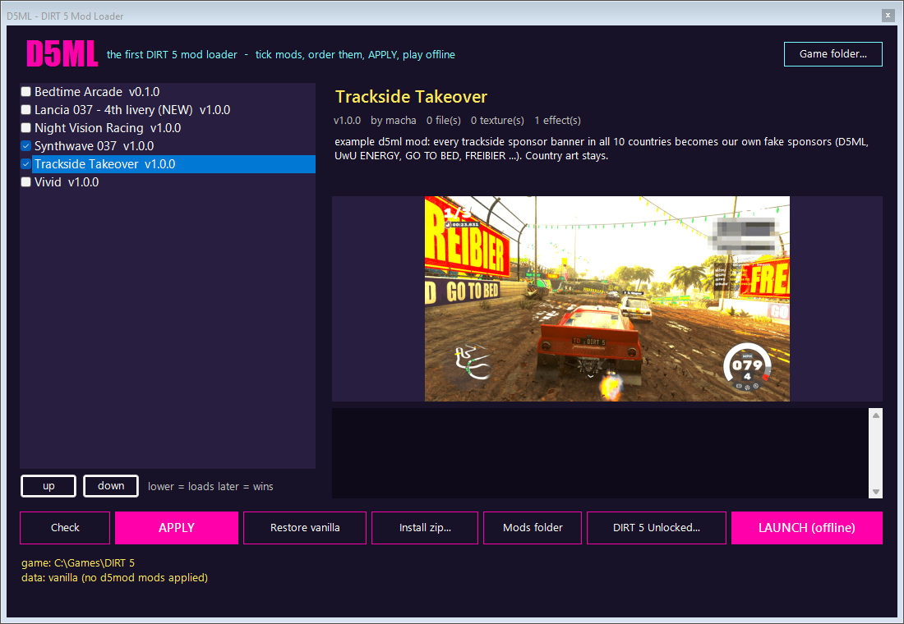
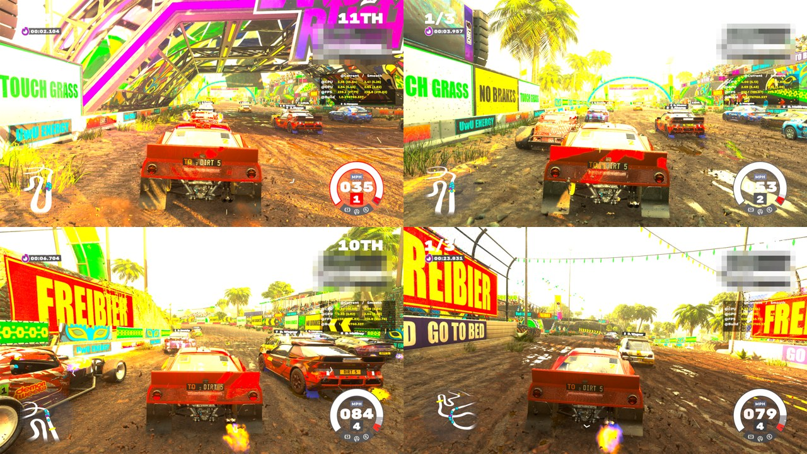
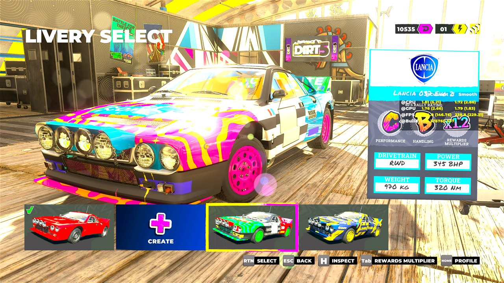
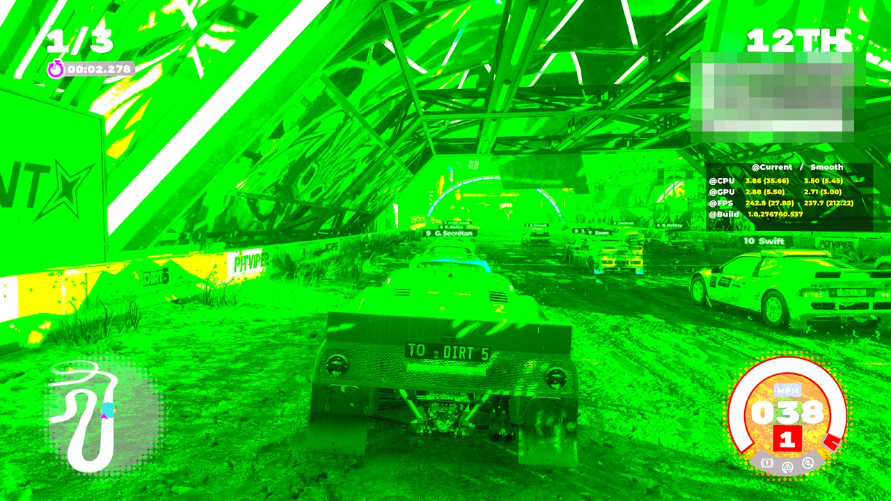
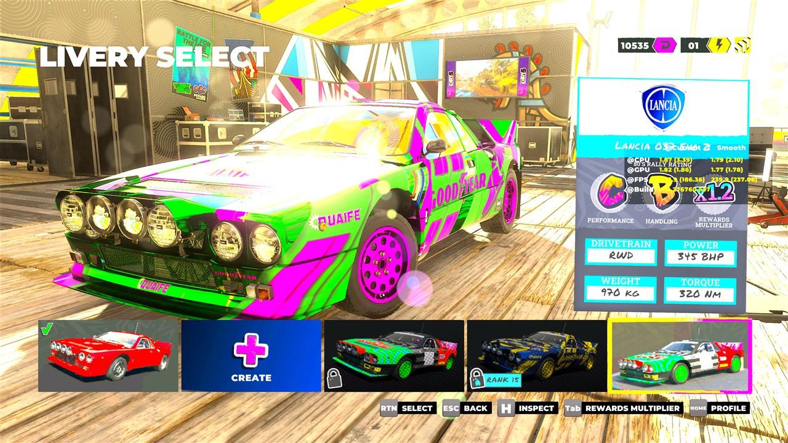

# D5ML — the DIRT 5 Mod Loader

> **⚠ Read this first.**
> - **About 99 % of the code, tools and docs were written by an AI** (Claude Code), directed and play-tested by us. We did not write most of this code ourselves and can't vouch for every line.
> - **Hobby project:** [@6uhrmittag](https://github.com/6uhrmittag) and [@VoidCrowned](https://github.com/VoidCrowned) enjoy DIRT 5 very, very much and just wanted a bit more variety in this lovely game.
> - **Nothing is guaranteed** — no warranty, no support promise, no roadmap. Things may break, may not work on your version of the game, or may mess up your game data (*Restore vanilla* exists; keep your own backups anyway).
> - Offline only. Not affiliated with or endorsed by Codemasters or EA. No game files are included.

**The first mod loader for DIRT 5.** Drop mods into a folder, tick them, press APPLY, race. One click takes you back to vanilla. Your original game files are never touched.











## What it can do

- **Replace any game file** — car physics (`.vdef`), AI tuning, UI texts, anything in the packs, **at any size** (bigger files are relocated automatically)
- **Add brand-new files** — anything under `files/` the game doesn't have yet is added to the packs (folders included). Proven in-game: a new car-physics file hooked into the Lancia 037's inheritance chain is loaded by the game
- **New content** — `clone` copies game files under a new name (textures keep valid internal names/hashes) and `json` adds entries to the game's databases. First result: **a brand-new 4th livery slot for the Lancia 037**, unlocked, in the livery select and in races
- **Replace any texture with a PNG** — UI art, posters, car liveries, environment textures, trackside banners. D5ML re-encodes your picture into the texture's own format (BC1, BC4, BC5, BC7, RGBA8 and the HDR formats), size and full mip chain, including the streamed high-res levels (`_tier1/_tier2.gmp`) and texture arrays
- **Effects** — recolour or decal a texture *from the player's own copy* at install time (`hue`, `saturate`, `invert`, `overlay` your own PNG). Mods built this way ship **zero Codemasters pixels**
- **Colour grading without ReShade** — DIRT 5's own per-track grading LUTs are editable: `grade` (saturation, contrast, brightness, hue, tint) or stack one of the game's photo-mode filters (night vision, black & white, vintage, teal/orange …) on top with `lut`
- **Recipes** — built-in number tweaks and presets (moon gravity, black ice, tipsy cars, UwU menus …)
- **Load order + conflict report** — later mods win, D5ML tells you who overwrites whom
- **Drag & drop install** — drop a mod `.zip` onto the window
- **DIRT 5 Unlocked** built in — launch with the game's hidden developer options (Micro Machines camera, autopilot, unlocks, no HUD …)

## Install

1. Unzip anywhere (e.g. `Documents\D5ML`)
2. Double-click **`D5ML.bat`** — first start installs the Python packages it needs (needs [Python 3.12+](https://www.python.org/) and [PowerShell 7](https://aka.ms/powershell); the bat tells you if one is missing)
3. If DIRT 5 isn't found automatically: **Game folder…** → pick the folder that contains `game_release.exe`
4. Tick mods → **APPLY** → **LAUNCH (offline)**

Uninstall everything: **Restore vanilla**, then delete the folder.

## Included example mods

| mod | what it shows |
|---|---|
| **Lancia 037 — 4th livery (NEW)** | adds a livery the game never had: new texture files + a new livery-database entry. Shows up as a fifth tile in livery select, unlocked |
| **Trackside Takeover** | every trackside sponsor banner in all 10 countries becomes our own fake sponsors (D5ML, UwU ENERGY, GO TO BED, FREIBIER, TOUCH GRASS …) — the country art stays |
| **Synthwave 037** | all three Lancia 037 liveries recoloured + our own star decals — generated on your PC, the mod contains only `stars.png`. Liveries 02/03 are rank-locked on new profiles: start with *All items unlocked* (DIRT 5 Unlocked) to pick them |
| **Vivid** | punchier colour grade on every track and weather (+22 % saturation, +6 % contrast) — a graphics mod made from the game's own LUTs; verified in-game |
| **Rival Roster** | the AI field gets silly names in all 9 languages — `Captain Handbrake`, `Grandma Sideways`, `Professor Airtime` … (81 drivers, any length, via the new `text` key) |
| **Night Vision Racing** | the game's photo-mode night-vision filter on every track. You're welcome. |
| **Bedtime Arcade** | our own Arcade poster art + longer menu texts (`QUIT` → `GO TO BED`, `START EVENT` → `ONE MORE RACE!!`) |

## Make your own mod (5 minutes)

```
python scripts\d5ml.py new my-mod "my first DIRT 5 mod"
python scripts\d5ml.py search lancia livery
python scripts\d5ml.py extract my-mod "data:textures/vehicles/liveries/lancia_037_livery_02.gtx"
  -> edit mods\my-mod\textures\...\lancia_037_livery_02.gtx.png in any paint program
     (lancia_037_livery_02.guide.png next to it shows the paint regions)
python scripts\d5ml.py check my-mod
python scripts\d5ml.py apply my-mod
```

Folder layout (`mods\README.md` has the details):

```
mods/<name>/mod.json                  name, version, author, description, recipes, generate (effects)
mods/<name>/files/<path>              replaces data:<path> (any size)
mods/<name>/textures/<path>.gtx.png   replaces that texture (all resolution levels)
mods/<name>/preview.png               shown in the D5ML window
```

Please **don't upload extracted Codemasters files**. Share your own art, and use `generate` effects when you build on the original textures.

## Is it safe?

- The shipped `.dat` packs are **never written**. Changes go into an unused pack slot plus a patched index (`dat\index\dat.ndx`, backed up as `dat.ndx.d5x-orig`). *Restore vanilla* puts the backup back.
- **Offline only.** The launcher always adds `--disableonline`. Never take modded data into online races.
- Every apply is verified: patched files are read back, and neighbouring files are checked to be unchanged.

## Compatibility

- **Tested:** DIRT 5 Microsoft Store build v1.2767.60 as a regular (loose) folder install, Windows 11.
- **Sealed Xbox app installs** (WindowsApps) can't be modded — Windows blocks writes there.
- **Steam:** untested. D5ML refuses to run if the index format differs (safe), so please report what happens!
- Game data is read at boot, so apply/restore with the game closed.

## FAQ

**The window says the game is running.** Quit DIRT 5 first; D5ML won't change data while the game has it loaded.

**My texture looks blocky.** That's the compression the game uses (BC1/BC7). Big flat colours and bold shapes survive best.

**Something doesn't work.** Run `python scripts\d5ml.py doctor` in the D5ML folder and post its output in the bug report. It checks Python packages, the game folder, the index format and every installed mod (typos in `mod.json` are reported with the line).

**Can mods add new cars/tracks?** New *files* work (the game loads them when existing data points at them, e.g. a new physics file in a car's inheritance chain). A complete new car or track also needs models, database entries and UI data — nobody has mapped that yet.

## Credits

Made by **macha** — pack format, texture formats and the loader reverse-engineered from scratch in 2026. Source and format notes are in the project repo (`FINDINGS.md`).

## Changelog

- **1.1.0** — `text` in mod.json: set or **add** UI texts in all 9 languages by LocID name, any length (with a warning for characters the Japanese/Korean/Chinese fonts don't have); `json` → `set_object` edits existing database entries in place; `d5ml.py new-livery <car> [--png]` adds a new livery slot to any of 79 cars; fixed `.loc` parsing of three files (`ps4/sim`, `xbox/fre`, `xbox/ita`). New example mod: Rival Roster.
- **1.0.0** — first release: loader + window, any-size file replacement, PNG textures in all formats incl. streamed tiers, effects, recipes, drag & drop install, DIRT 5 Unlocked.
